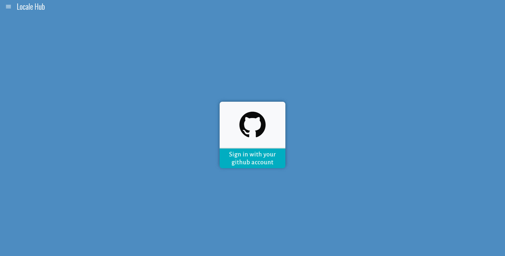
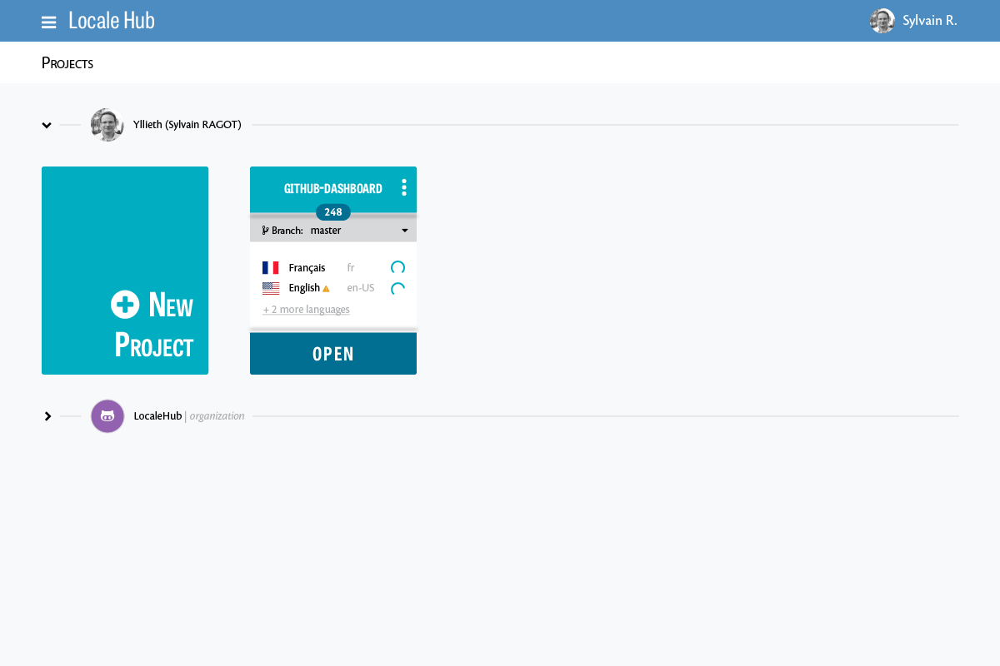
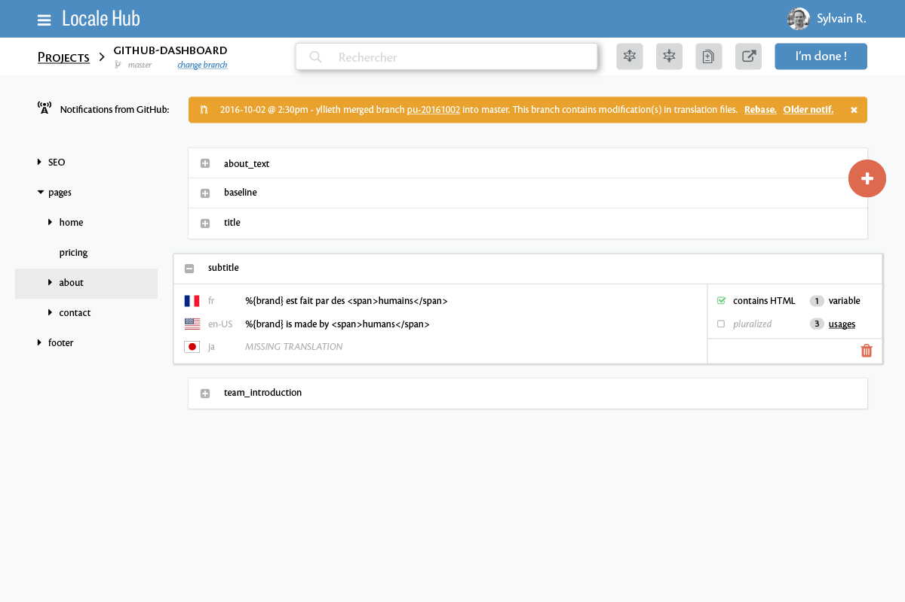
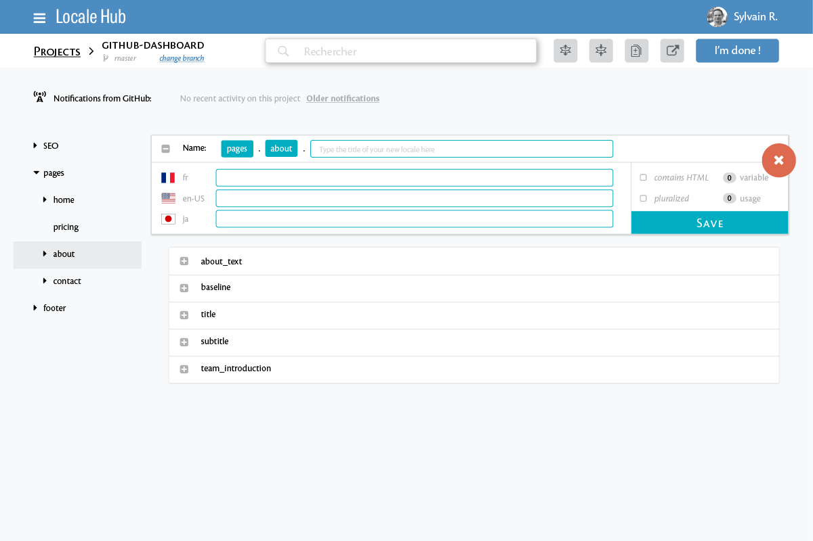

# Localehub

> This application is dedicated for non-developer people who are in charge of adding/updating I18N (Internationalization) support to an existing application.
>
> **Pain #1**: Non-developer people aren't comfortable with editing codebase directly on github or within any tool or IDE that can access production code ... and they are right!!
>
> **Pain #2**: Existing tool which provide an interface to edit I18N strings doesn't support the concept of branch. As a result, when people from the marketing team edits I18N strings, an other developer may have pushed a new piece of code which overrides these editions.

## Features specification

### MVP - v1.0
- `TODO` Login to the application from a github account.
- `TODO` Create a project from an existing github repository.
- `TODO` List created project and show the number of I18N strings, available branches, and, supported languages.
- `TODO` Allow the user to edit I18N files in a secured way: it must guarantee that any other file will be modified.
- `TODO` Allow the user to work on different github branches.
- `TODO` Once all modification are done, create a pull-request with -at least- one assignee.
- `TODO` Allow the user to receive notifications from github on each change on the current repository and see if it affects his current work.

### Additional cool features - v1.1

- `TODO` When the user views the list of existing translations, ha can search, open/collapse all translations, see his changes, export in different formats.
- `TODO` On a specific translation, the user can see 
  - if it contains a valid HTML tags, 
  - if this strings has pluralized version,
  - how many variable the string contains
  - how many time it is used in the code
  - usages of this translation in his code
- `TODO` Automatically find translation files according to project type (Rails, Django, Play, Symfony, ... all these frameworks have usual location for them)

## Mockups

### Login


### Projects list


### String edition


### String addition


## Project Installation

```
git clone git@github.com:yllieth/localehub.git
cd localehub
npm install
npm start
```
